# PinAI Frontend

PinAI 前端项目 - AI 服务供应商管理平台

## 📖 项目简介

PinAI Frontend 是一个基于 Vue 3 + TypeScript 的现代化前端应用，用于管理和监控 AI 服务供应商。提供供应商配置、API 密钥管理、模型管理、健康状态监控、数据统计仪表盘等功能。

<!-- 项目截图占位符 -->

> 📸 **项目截图**
>
> 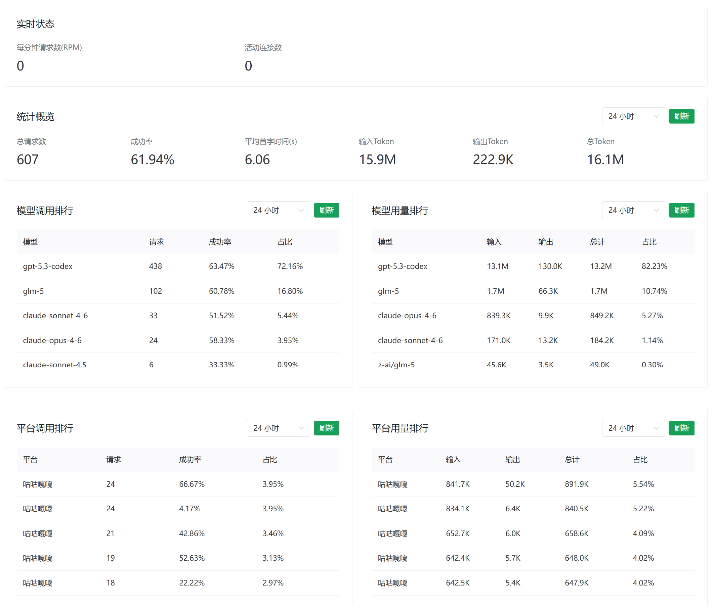
> _仪表盘页面 - 展示统计概览和实时数据_
>
> 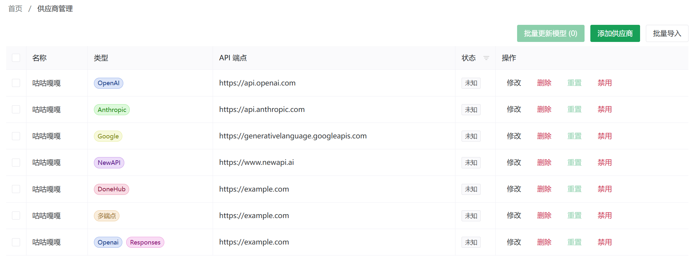
> _供应商管理页面 - 管理平台、模型和 API 密钥_

## ✨ 功能特性

### 📊 仪表盘 (Dashboard)

- 统计概览：展示请求总数、Token 使用量等核心指标
- 实时统计：实时显示当前请求数据
- 调用排行：模型和平台的调用次数排名
- 使用量排行：模型和平台的 Token 使用量排名
- 支持时间范围筛选（24 小时/7 天）

### 🏢 供应商管理 (Provider)

- 平台管理：创建、编辑、删除 AI 服务平台
- 模型管理：配置平台下的 AI 模型及其别名
- API 密钥管理：管理各平台的 API 认证密钥
- 端点配置：自定义 API 端点和请求头
- **批量导入**：快速导入供应商配置
  - 文本解析：支持从文本批量解析供应商信息
  - 自动获取模型：导入时自动拉取平台可用模型
  - 模型自动重命名：应用预设规则自动重命名模型
  - **快捷端点配置**：根据供应商类型自动配置多个 API 端点
    - OpenAI：chat_completions + responses
    - NewAPI/DoneHub：openai + google + anthropic 多端点
    - 其他供应商：自动匹配对应的端点类型
- **批量更新模型**：跨平台批量更新模型配置
  - 从供应商列表选择多个平台
  - 自动获取各平台的最新模型列表
  - 差异对比：清晰展示新增、删除、保留的模型
  - 一键同步：批量应用模型变更
- **模型自动重命名**：灵活的模型名称转换规则
  - 插入规则：在指定位置添加前缀、后缀或自定义文本
  - 替换规则：简单的文本替换
  - 正则规则：使用正则表达式进行复杂匹配和替换
  - 大小写规则：统一转换为大写或小写
  - 规则持久化：自动保存到本地存储
  - 拖拽排序：调整规则执行顺序

### ❤️ 健康监控 (Health)

- 概览视图：展示平台、密钥、模型的健康状态统计
- 平台健康：查看各平台的健康状态和错误信息
- 密钥健康：监控 API 密钥的可用性
- 模型健康：追踪各模型的运行状态
- 问题恢复：一键恢复异常状态

### ⚙️ 系统配置

- API 服务器配置：支持多服务器切换
- 主题切换：明暗主题自适应
- 版本检查：自动检测新版本

## 🛠️ 技术栈

### 核心框架

- **Vue 3** ^3.5.18 - 渐进式 JavaScript 框架
- **TypeScript** ~5.8.0 - 类型安全的 JavaScript 超集
- **Vite** (rolldown-vite) - 下一代前端构建工具

### 状态管理 & 路由

- **Pinia** ^3.0.3 - Vue 状态管理库
- **Vue Router** ^4.5.1 - Vue.js 官方路由

### UI 组件库

- **Naive UI** ^2.42.0 - Vue 3 组件库
- **VueDraggable Plus** ^0.6.0 - 拖拽组件
- **@vicons/ionicons5** / **@vicons/material** - 图标库

### 工具库

- **@vueuse/core** ^14.1.0 - Vue Composition API 工具集

### 开发工具

- **ESLint** ^9.31.0 + **OxLint** ~1.8.0 - 代码检查
- **unplugin-auto-import** - 自动导入 Vue API
- **unplugin-vue-components** - 组件按需加载
- **unplugin-vue-router** - 文件系统路由

## 📁 项目结构

```text
src/
├── assets/              # 静态资源
├── components/          # 可复用组件
│   ├── common/          # 通用组件
│   ├── health/          # 健康监控相关组件
│   ├── layout/          # 布局组件
│   ├── provider/        # 供应商管理相关组件
│   └── system/          # 系统配置相关组件
├── composables/         # 组合式函数
│   ├── useApiServerCheck.ts
│   ├── useHealthActions.ts
│   ├── useHealthState.ts
│   ├── useProviderActions.ts
│   ├── useProviderBatchUpdate.ts
│   ├── useProviderForm.ts
│   ├── useProviderModels.ts
│   ├── useProviderState.ts
│   └── useServerValidation.ts
├── pages/               # 页面组件（自动路由）
│   ├── dashboard.vue    # 仪表盘
│   ├── health.vue       # 健康监控
│   ├── provider.vue     # 供应商管理
│   ├── logs.vue         # 日志
│   ├── about.vue        # 关于页面
│   └── provider/        # 供应商子页面
│       ├── index.vue
│       ├── add.vue
│       ├── [id].edit.vue
│       ├── batch-import.vue
│       └── batch-update.vue
├── router/              # 路由配置
├── services/            # API 服务层
│   ├── healthApi.ts     # 健康检查 API
│   ├── http.ts          # HTTP 客户端
│   ├── providerApi.ts   # 供应商 API
│   ├── proxyApi.ts      # 代理 API
│   ├── statsApi.ts      # 统计 API
│   └── versionCheck.ts  # 版本检查
├── stores/              # Pinia 状态管理
│   ├── apiServerStore.ts
│   ├── batchUpdateStore.ts
│   ├── providerStore.ts
│   ├── renameRulesStore.ts
│   └── themeStore.ts
├── types/               # TypeScript 类型定义
│   ├── api.ts
│   ├── health.ts
│   ├── provider.ts
│   ├── proxy.ts
│   ├── rename.ts
│   └── stats.ts
└── utils/               # 工具函数
    ├── errorHandler.ts
    ├── numberUtils.ts
    ├── rename.ts
    ├── timeUtils.ts
    └── uuid.ts
```

## 🚀 快速开始

### 环境要求

- **Node.js**: ^20.19.0 或 >=22.12.0
- **包管理器**: npm

### 安装依赖

```bash
npm install
```

### 开发模式

```bash
npm run dev
```

启动开发服务器，访问 `http://localhost:5173`

### 生产构建

```bash
npm run build
```

### 预览构建

```bash
npm run preview
```

### 代码检查

```bash
# 运行所有检查
npm run lint

# 单独运行 OxLint
npm run lint:oxlint

# 单独运行 ESLint
npm run lint:eslint
```

### 类型检查

```bash
npm run type-check
```

## ⚙️ 配置说明

### 环境变量

创建 `.env.development` 或 `.env.production` 文件：

```bash
# API 服务器地址（可选，可在界面中配置）
VITE_API_BASE_URL=http://localhost:3000/api
```

### API 服务器配置

项目支持在界面中配置多个 API 服务器，支持：

- 服务器 URL 配置
- Bearer Token 认证
- 服务器切换

<!-- 配置页面截图占位符 -->

> 📸 **配置页面截图**
>
> 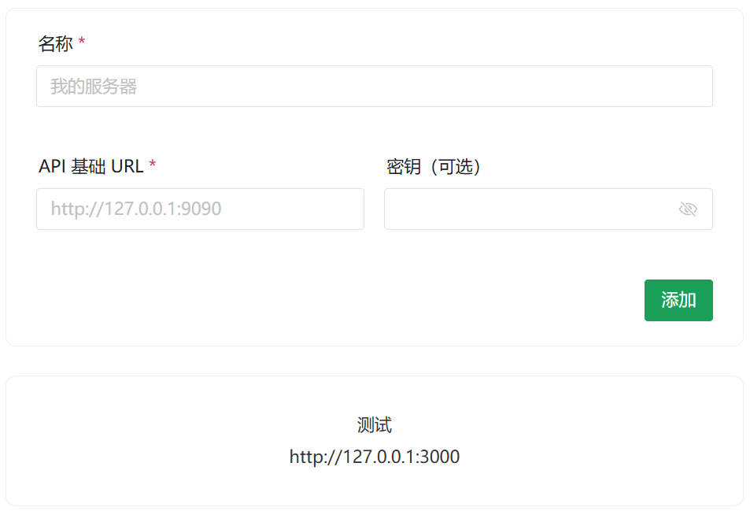
> _API 服务器配置界面_

## 📦 自动配置

### 自动导入

通过 `unplugin-auto-import`，以下 API 无需手动导入：

- Vue API: `ref`, `reactive`, `computed`, `watch`, `onMounted` 等
- Naive UI: `useDialog`, `useMessage`, `useNotification`, `useLoadingBar`

### 组件按需加载

通过 `unplugin-vue-components`，Naive UI 组件自动按需加载，无需手动导入。

### 文件路由

通过 `unplugin-vue-router`，`src/pages/` 目录下的文件自动生成路由：

| 文件路径                       | 路由路径             |
| ------------------------------ | -------------------- |
| `pages/index.vue`              | `/`                  |
| `pages/dashboard.vue`          | `/dashboard`         |
| `pages/provider.vue`           | `/provider`          |
| `pages/provider/index.vue`     | `/provider`          |
| `pages/provider/add.vue`       | `/provider/add`      |
| `pages/provider/[id].edit.vue` | `/provider/:id/edit` |

## 🎨 开发规范

### 组件命名

- 组件文件：PascalCase（如 `UserCard.vue`）
- 页面文件：kebab-case（如 `user-profile.vue`）

### TypeScript

- 启用严格模式
- 使用 `<script setup lang="ts">` 语法糖

### 代码风格

- 使用 ESLint + OxLint 双重检查
- 遵循 Vue 官方风格指南

## 📸 功能截图

<!-- 更多功能截图占位符 -->

### 仪表盘

> 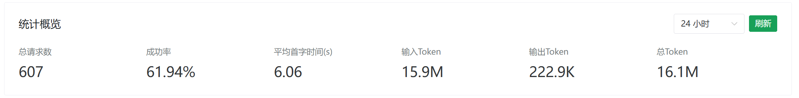
> _统计概览卡片_
>
> 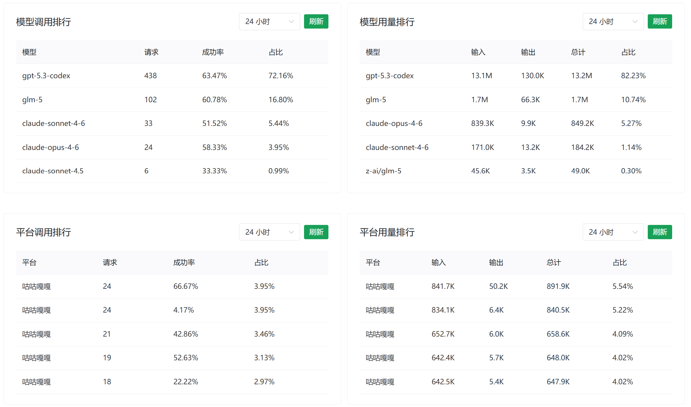
> _模型和平台调用排行_

### 供应商管理

> 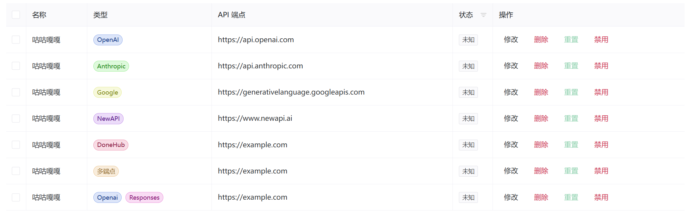
> _供应商列表页面_
>
> 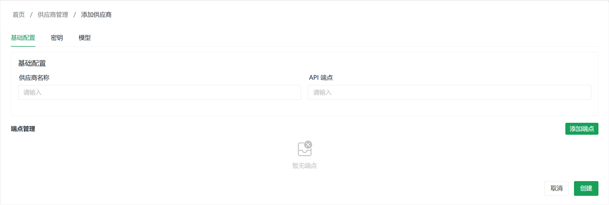
> _添加新供应商表单_
>
> 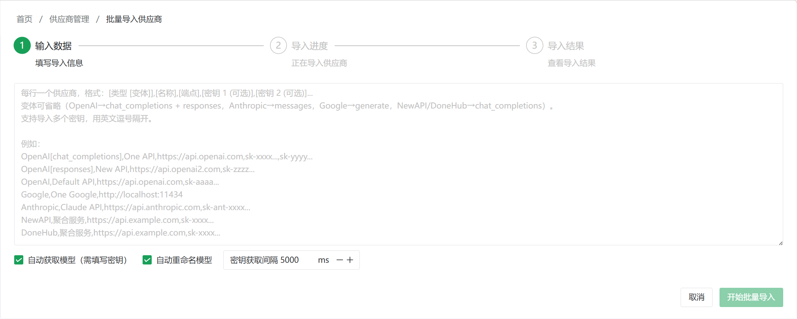
> _批量导入供应商_
>
> 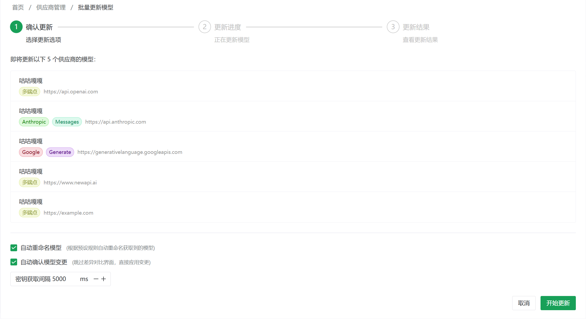
> _批量更新多个平台的模型配置_
>
> 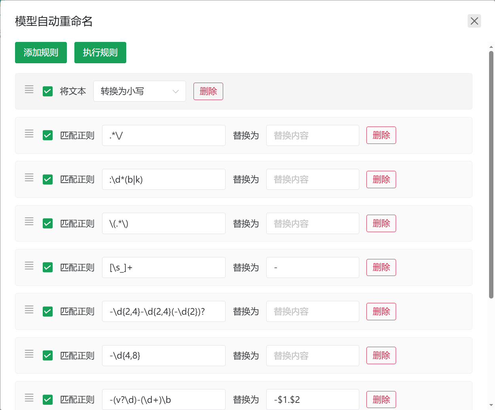
> _模型名称自动重命名规则管理_

### 健康监控

> 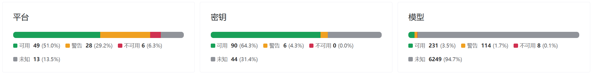
> _健康状态概览_
>
> 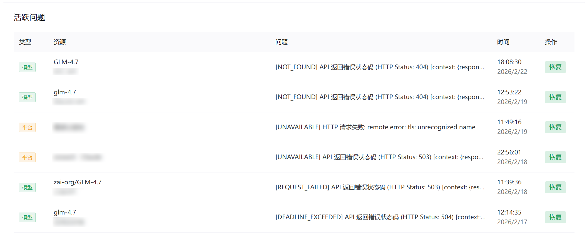
> _健康状态详情列表_

## 🔗 相关链接

- [Vue 3 文档](https://vuejs.org/)
- [Vite 文档](https://vite.dev/)
- [Naive UI 文档](https://www.naiveui.com/)
- [Pinia 文档](https://pinia.vuejs.org/)
- [VueUse 文档](https://vueuse.org/)

## 📄 许可证

本项目为私有项目，仅供内部使用。
